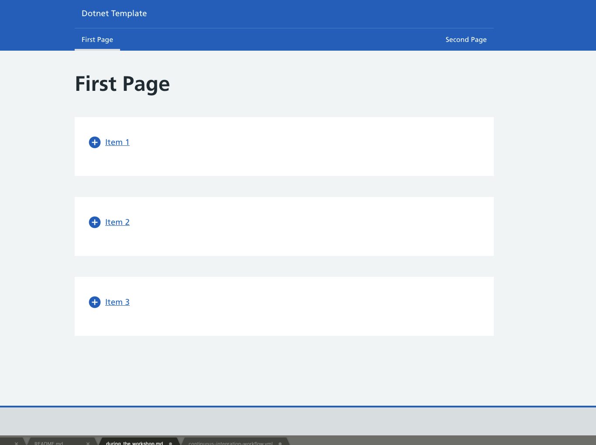

# Workshop 7 Instructions

## Part 1 (Github Actions)

### Step 1 - Get the code

We'll be working on top of this repository. Because you'll need to change some settings on the repository later in the workshop, it's recommended that you [fork](https://docs.github.com/en/github/getting-started-with-github/fork-a-repo) the repository instead of cloning it. To do that:
1. Click the Fork button in the top right on the repository page. 
2. Select your GitHub user when it asks you where you should fork it to.
3. This should take you to a fork of the repository on your account, e.g. https://github.com/MyUser/DevOps-Course-Workshop-Module-07-Learners where MyUser will be replaced by your username. 
4. You can now clone and push to that repository as normal.

### Step 2 - Set up the app

This repository contains a minimal .NET Core app. You don't need to worry about exactly how the code works, but you should be able to build, test and run it. It uses [npm](https://www.npmjs.com/) which is a package manager for the Node JavaScript platform. 

#### Build
1. Run `dotnet build` from the terminal in the project folder. This will build the C# code.
2. Run `npm run build` (if it's your first time building you also need to run `npm install`) in the DotnetTemplate.Web folder. This will build the typescript code.

#### Run
1. Run `dotnet run` in the DotnetTemplate.Web folder. This will start the app.
2. You can now see the website by going to [http://localhost:5000/](http://localhost:5000/). You should see something like the image below.



#### Test
1. Run `dotnet test` inside the project folder. This will run the C# tests in the DotnetTemplate.Web.Tests project.
2. Run `npm t` inside the DotnetTemplate.Web folder. This will run the typescript tests in DotnetTemplate.Web/Scripts/spec. They're run using [Jasmine](https://jasmine.github.io/).
3. Run `npm run lint` inside the DotnetTemplate.Web folder. This will run linting on the typescript code, using [eslint](https://eslint.org/).

### Step 3 - Set up GitHub Actions

1. Create the config file for your continuous integration pipeline. This should be created in .github/workflows and you can name it whatever you like, although it needs to have a .yml extension, e.g. continuous-integration-workflow.yml.
2. Implement a basic workflow:
```
name: Continuous Integration
on: [push]                      # Will make the workflow run every time you push to any branch

jobs:
  build:
    name: Build and test
    runs-on: ubuntu-latest      # Sets the build environment a machine with the latest Ubuntu installed
    steps:
    - uses: actions/checkout@v2 # Adds a step to checkout the repository code
```
3. Commit and push your changes to a branch on your repository.
4. On your repository page, navigate to the Actions tab. 
5. You should see a table of workflows. This should have one entry with a name matching your latest commit message. Select this entry.
6. On the next page click "Build and test" on the left. This should show you the full output of the workflow which ran when you pushed to your branch. See [the documentation](https://docs.github.com/en/actions/configuring-and-managing-workflows/managing-a-workflow-run) for more details on how to view the output from the workflow.

See [the GitHub documentation](https://docs.github.com/en/actions/configuring-and-managing-workflows/configuring-and-managing-workflow-files-and-runs) for more details on how to set up GitHub Actions and https://docs.github.com/en/actions/reference/workflow-syntax-for-github-actions for more details on the syntax of the workflow file.

### Step 4 - Add more actions
Currently our workflow only checks out the code, which isn't that useful. We want to add some more useful steps to the workflow file. Each step in the workflow file either needs to:
- Run a command, as in the terminal, for example:
```
name: Continuous Integration
on: [push]

jobs:
  build:
    name: Build and test
    runs-on: ubuntu-latest
    steps:
    - uses: actions/checkout@v2


    - name: Hello world       # Name of step
      run: echo 'Hello world' # Command to run
```
- Use an action. You specify this using the `uses` keyword, followed by the name of the action. The name of the action is of the form `GitHubUsername/RepositoryName`. The action can be one supplied by GitHub, in which case you can find it here: https://github.com/actions. It could also be one created by someone else, in which case you can find them by googling or by browsing https://github.com/marketplace?type=actions. You can also create your own action, or fork an existing action to make changes to it. For example:
```
name: Continuous Integration
on: [push]

jobs:
  build:
    name: Build and test
    runs-on: ubuntu-latest
    steps:
    - uses: actions/checkout@v2

    - name: Hello world
      uses: actions/hello-world-javascript-action@v1.1 # Name of the action. This uses https://github.com/actions/hello-world-javascript-action
      with:                                            # This section is needed if you need to pass arguments to the action
        who-to-greet: 'Mona the Octocat'
```

You should amend your workflow file so that it:
1. Builds the C# code.
2. Runs the C# tests.
3. Builds the typescript code.
4. Runs the linter on the typescript code.
5. Runs the typescript tests.

### (Stretch goal) Slack notifications
To make sure people are aware when there are issues with the build, it can be useful to send a slack notification at the end of the workflow.

**Before attempting this step please create your own personal slack workspace. This is free and can be set up [here](https://slack.com/create).**

1. Add a slack notification at the end of the workflow. To make this work you will need to use the slack app [incoming webhooks](https://softwire.slack.com/apps/A0F7XDUAZ-incoming-webhooks?next_id=0), make sure this has been installed in the slack workspace you're using.
2. Make the workflow post a different message if the workflow failed, so that it's obvious if the workflow failed.
3. Make the workflow post a different message if the workflow was cancelled.

### (Stretch goal) Workflow status badge
Add a [workflow status badge](https://docs.github.com/en/free-pro-team@latest/actions/managing-workflow-runs/adding-a-workflow-status-badge) to your repository.

### (Stretch goal) Change when the workflow is run
Change your workflow so that it only runs when pushing to the main branch or by raising a PR. Is there a way to ensure that no one can update the main branch except through a PR that has passed the workflow?

## Part 2 (Jenkins)

### Step 1 - Run Jenkins locally
There are two options for running Jenkins locally, you can either install Jenkins or run it through docker. We would recommend running Jenkins through docker and the instructions for that are [here](https://www.jenkins.io/doc/book/installing/#docker).

### Step 2 - Set up Jenkins
Once you've done the step above you should have Jenkins running on http://localhost:8080/. If you go to this url in a browser it should show you a setup page.
1. Login with the password you got from the logs when starting Jenkins.
2. Now you have the option to select some initial plugins. For now, make sure you tick the GitHub plugin. We won't need any others right away, and you can add more later.
3. Create an admin user.
4. Use the default jenkins url (http://localhost:8080)

You should now see the Jenkins dashboard. 

### Step 3 - Set up a Jenkins build
We now want to get Jenkins to build our app. To do this you need to create a job on Jenkins for our app and create a [Jenkinsfile](https://www.jenkins.io/doc/book/pipeline/jenkinsfile/) in your repository to define what the job should do.

#### Create a Jenkins job
From your Jenkins dashboard:
1. Select New Item.
2. Set it to a multibranch pipeline. This means the job will scan your repository for branches and run the job on any branch with a Jenkinsfile.
3. Leave all the defaults other than setting the branch sources to GitHub. Leave the defaults for the branch source other than setting the repository url to your repository url. You may notice a warning about not using GitHub credentials at this point. This is fine, as we're just reading from a public repository we don't need credentials. If we were using a private repository or we were writing to the repository during the job, then we would need to set up credentials.
4. Click Save to create the Jenkins job.

#### Create a Jenkinsfile
See https://www.jenkins.io/doc/book/pipeline/jenkinsfile/ for details on how to create a Jenkinsfile. We want to add the same steps as for the GitHub Actions workflow so that it:
1. Builds the C# code.
2. Runs the C# tests.
3. Builds the typescript code.
4. Runs the linter on the typescript code.
5. Runs the typescript tests.

You have 2 options for installing .NET Core & npm inside jenkins:
1. Make installation separate build stages
    * This is not ideal as you will have to run the installation on each build
2. [Specify containers to run stages of the jenkins pipeline with .NET Core and npm pre-installed](https://www.jenkins.io/doc/book/pipeline/docker/)
    * There are some pre-built images for npm (e.g. `node:14-alpine`) but for .NET Core you'll want to use either [Microsoft's images](https://hub.docker.com/_/microsoft-dotnet-core-sdk) or [script the installation from a base image such as alpine linux](https://docs.microsoft.com/en-us/dotnet/core/install/linux-alpine)

#### Run the Jenkins job
1. Commit and push your new Jenkinsfile.
2. From your Jenkins dashboard select the job you created. 
3. Click "Scan Multibranch Pipeline Now". This will scan the repository for branches and run the job on any branch with a Jenkinsfile.
4. Select your branch, which should appear under "Branches" once the scan is done.
5. You should see a stage view of the build, showing each stage in the Jenkinsfile. If the stage succeeded it will be green, if it failed it will be red.
6. Select the most recent build from the build history on the left. 
7. Click "Console Output" to view the full logs from the build.

### (Stretch goal) Slack notifications
Like for the GitHub Actions workflow, add slack notification to the Jenkins job. To make this work you will need to use the slack app [jenkins ci](https://slack.com/apps/A0F7VRFKN-jenkins-ci?next_id=0), make sure this has been installed in the slack workspace you're using.

### (Stretch goal) Create a Docker Compose file for Jenkins
The jenkins container setup instructions [here](https://www.jenkins.io/doc/book/installing/#docker) involve running several docker commands in sequence which isn't ideal. Create a docker-compose file that will setup both containers and volumes by simply running `docker-compose up`.

### (Stretch goal) Use a Single Build Agent for the Jenkins Pipeline
Can you create a single container that can be used as the sole build agent for the entire multistage Jenkins pipeline?